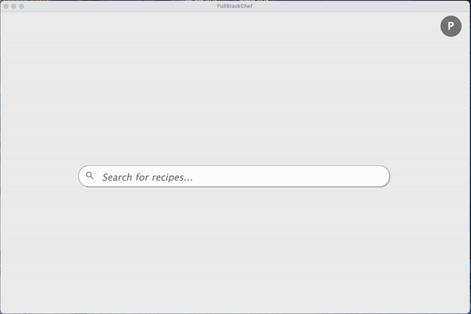
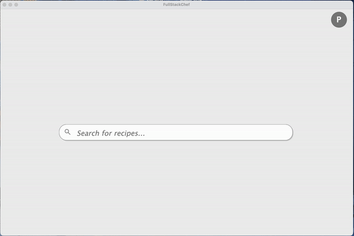

# **FullStackChef**

## Authors
- Jasmine Jasmine
- Tadd Mao
- Shaojie Chung
- Jasmine Willy Saphira
- Mousa Samer El-sururi

## About FullStackChef
**FullStackChef** is a collaborative recipe management application designed to simplify meal planning and cooking 
for people who are busy. It allows users to search recipes by ingredients and offers additional functionalities tailored to individual user needs.

## Table of Contents
1. [Features](#features)
2. [Installation](#installation)
3. [Usage](#usage)
4. [License](#license)
5. [Feedback and Contributions](#feedback-and-contributions)

## Features
### Team User Story
- **Search Recipes by Ingredients**: Find recipes based on available ingredients

### Individual User Stories
- **Generate Meal Plan** (by Jasmine Jasmine): Generates a weekly meal plan.
- **Grocery List** (by Tadd Mao): Generate a grocery shopping list based on the meal plan.
- **Favorites** (by Shaojie Chung): Save your favorite recipes for quick access.
- **History** (by Jasmine Willy Saphira): Track your previously viewed recipes.
- **Display Recipe** (by Mousa Samer El-sururi): View detailed recipe instructions and ingredients.

## Installation
**What is needed**
- Java 17
- Maven
- IntelliJ IDEA
- Mac OS or Windows OS computer

**Instructions**
1. Clone the repository:
   ```bash
   git clone https://github.com/tdM05/FullStackChef.git
   cd <Where you cloned the repository>
   ```
2. Navigate to src/java/MainApp and run it.

**Common Issues**
- If you are having trouble running the app, make sure you have Java 17 installed.
- If buttons in the app are not working, make sure the spoonacular API key 
in src\main\java\data_access\Constants.java called API_KEY is not used up.

## Usage
1. **Search Recipes by Ingredients**
   - Once you run the app, you will be prompted to log in or sign up.
   - After logging in, you will be redirected to the search page.
   - Here you can search recipes by ingredients in the format: "ingredient1, ingredient2, ingredient3, ...".
   - Click the "Search" button to find recipes that match your ingredients.
   - Click on the recipe panel to view detailed instructions and ingredients needed.
     
   
     
     
**For the following use cases**, you can navigate to their buttons by hovering over the profile
   button in the top right corner.
2. **Favorites**
      - Search for a recipe and go into its detailed view.
      - Click the heart button to add it to your favorites
      - Go back to the search view and click the "Favorte" button that is in the profile dropdown.
   
   
   
3. **Generate Meal Plan**
    - Click on the "Meal Plan" button.
    - Click the "Generate Meal Plan" button to create a meal plan.
    - 
      

4. **Grocery List**
    - Click on the "Grocery List" button, found in the generate meal plan view
   or the profile dropdown. This will generate a list of ingredients that are 
   present in your meal plan. So if nothing is in your meal plan, nothing will
   be generated in your grocery list.
   
      
5. **History**
    - Click on the "History" button, found in the profile dropdown.
    - Here you can see all the recipes you clicked on in the search view.
   
      

## License
This project is dedicated to the public domain [CC0 1.0](LICENSE).
## Feedback and contributions
We welcome contributions to FullStackChef! Please follow the guidelines below:

### Feedback

1. Navigate to https://github.com/tdM05/FullStackChef/issues
2. Describe the problem or suggestion in detail. Feedback that does not
address a specific problem related to the project is unacceptable.
3. Provide any necessary steps to reproduce, if applicable.
4. Feedback can be expected within 24 hours, if we are not too busy.

### Making Changes
**Protocals for reviewing**:
You must checkout the pull request to ensure it runs, and that tests have 100% coverage
before approving. **If the tests do not have 100% coverage**, the pull request will not be approved.

**How to make Changes**:
1. Fork the repository by going to https://github.com/tdM05/FullStackChef and clicking the "Fork" button.
2. Create a new branch (`git checkout -b feature/your-feature-name`).
3. Make your changes.
4. Run tests to ensure your changes work and include them in your PR.
5. Submit a pull request (PR).

**Guidelines for a good merge request**
- The title should be descriptive and concise.
- The description should explain the changes made and why they were made.
- The PR should be linked to an issue.
- The PR should have tests that cover the changes made.
- The PR should have a screenshot or gif of the changes made.
- The PR should have a list of steps to test the changes made.
- The PR should have a list of steps to reproduce the issue if it is a bug fix.
